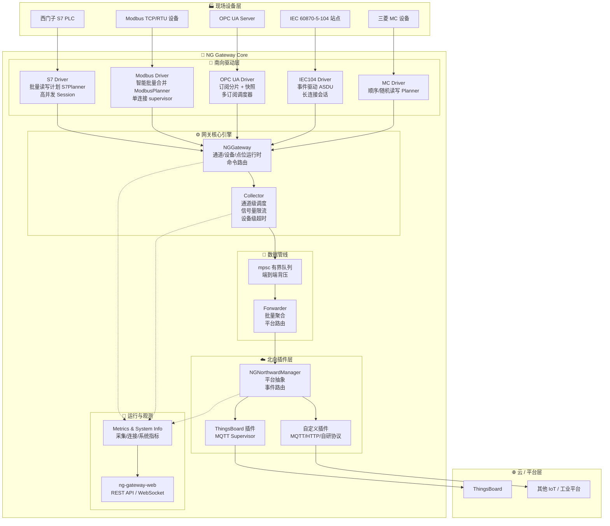
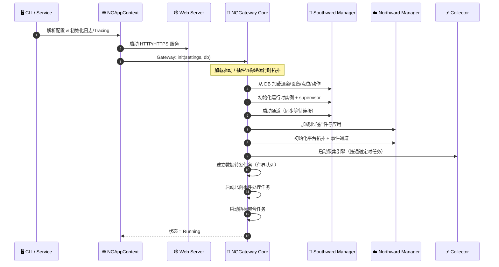
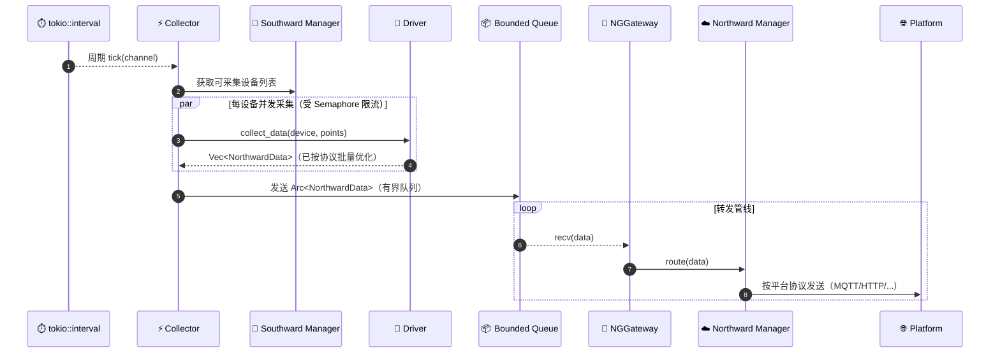
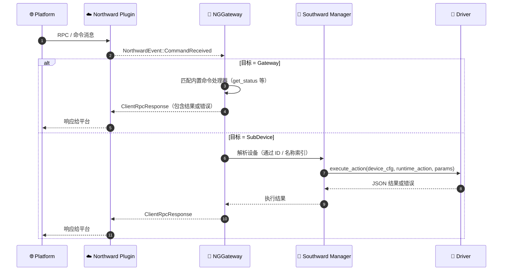

<div align="center">
  <a href="https://github.com/shiyuecamus/ng-gateway">
    
  </a>
  <br /><br />
</div>

<p align="center">
  <b>NG Gateway · 基于 Rust 的新一代工业物联网边缘网关</b>
</p>

<p align="center">
  高并发 · 高吞吐 · 低时延 · 强可靠 · 可观测 · 可扩展
</p>

<p align="center">
  <a href="https://www.rust-lang.org">Rust 1.70+</a> · Tokio 异步运行时 · 基于插件的南北向协议栈
</p>

---

## 🎯 产品定位与核心价值

- **产品定位**：`NG Gateway` 是面向工业现场的通用物联网边缘网关，负责在 **现场设备** 与 **云 / 私有平台** 之间进行高效、可靠的数据采集与指令转发。

- **典型场景**：
  - **工业自动化产线**：PLC / 变频器 / 传感器集中采集，上云做 OEE、报表与能耗分析。
  - **能源与公用工程**：电表 / 水表 / 热表 / 机房环境监控集中接入统一网关。
  - **楼宇与园区**：分散设备多协议接入，统一对接云平台或本地 BMS。

- **面向客户的直接价值**：
  - **统一协议接入**：一次部署，统一接入 Modbus / S7 / OPC UA / IEC104 / MC 等多种协议。
  - **极致性能与高可靠**：单机承载大量设备与点位，具备完备的背压和断线重连机制。
  - **灵活北向集成**：目前已提供 ThingsBoard 插件，其他云平台可通过插件快速扩展。
  - **运维友好**：Web 控制台、运行指标、健康检查与日志体系完整，便于运维与故障定位。

---

## 🏗️ 系统整体架构

### 🧩 整体模块划分

- **`ng-gateway-bin`**：网关启动入口，加载配置、初始化应用上下文。
- **`ng-gateway-common` / `ng-gateway-utils`**：通用工具、上下文管理、日志与配置。
- **`ng-gateway-models`**：统一的数据模型与配置模型（通道/设备/点位/动作、Settings 等）。
- **`ng-gateway-storage` + `ng-gateway-repository`**：基于 `sea-orm` 的 SQLite 存储与仓储层。
- **`ng-gateway-core`**：核心网关引擎（采集引擎、南向/北向管理器、运行时命令、监控指标）。
- **`ng-gateway-southward/*`**：南向协议驱动（Modbus / S7 / OPC UA / IEC104 / MC 等）。
- **`ng-gateway-northward/thingsboard`**：ThingsBoard 北向插件与 MQTT supervisor。
- **`ng-gateway-web`**：Web API + WebSocket 实时通道，为 UI 与外部系统提供管理接口。

### 🏗️ 高层架构图（Architecture Diagram）



### 🔌 核心运行链路

- **南向采集链路**：
  - Web / DB 中配置通道、设备、点位与动作；
  - `NGGateway` 启动时一次性加载拓扑，实例化南向驱动；
  - `Collector` 周期性按通道调度采集（`tokio::interval`），内部按设备并发、信号量限流；
  - 各驱动内部使用 **批处理读写计划（planner）** 与 **单连接 supervisor** 进行高效采集。

- **数据转发链路**：
  - 采集完成后封装为 `NorthwardData`（Telemetry / Attributes / RpcResponse 等）；
  - 通过有界 `mpsc::channel` 进入网关内部转发管线，具备端到端背压能力；
  - `NGNorthwardManager` 负责把数据路由到加载的北向插件（如 ThingsBoard）。

- **命令下行链路**：
  - 北向平台通过 MQTT RPC / 属性下发等方式发送命令；
  - 插件转为统一的 `NorthwardEvent`，通过内部事件队列交给 `NGGateway`；
  - `NGGateway` 基于目标类型（网关自身 / 子设备）路由到对应驱动动作执行。

---

## 🔁 核心时序与流程图

### 🚀 网关启动时序



### 📡 采集 → 聚合 → 转发流程



### 🔄 北向命令下行与动作执行



---

## 🔌 南向驱动设计与批处理优化

本网关的南向驱动不仅是“能连通”，而是针对每种协议都实现了 **高性能批处理算法** 与 **连接 supervisor 模型**，保证在大规模点位场景下依然能稳定、高效运行。

### Modbus：智能批量读写与单连接 supervisor

- **核心特点**：
  - 统一支持 **TCP / RTU**；
  - 所有点位在运行时被转换为 `ModbusPoint`，包含功能码、地址、数量、数据类型、缩放等；
  - **`ModbusPlanner`** 根据功能码与地址范围，自动构建 **批量读计划** 与 **写计划**。

- **读计划（`ModbusPlanner::plan_read_batches`）**：
  - 按功能码分组：同一批次只包含同一种功能码（例如全部 03 保持寄存器）；
  - 组内按地址排序；
  - 使用两个软约束：
    - **`max_gap`**：允许批次内存在多大地址空洞仍被合并；
    - **`max_batch`**：单批最大寄存器 span，保证帧长度在合理范围内；
  - 基于上述约束，将多个点位合并为少量连续批次，极大减少网络往返。

- **写计划（`ModbusPlanner::plan_write_plans`）**：
  - 根据动作参数与 Modbus 数据类型，利用 `ModbusCodec` 编码为寄存器/线圈数据；
  - 自动区分单寄存器 / 多寄存器 / 单线圈 / 多线圈写入；
  - 返回 `WritePlan` 列表，由驱动按顺序执行，保持写入顺序与原子性语义。

- **连接管理（`SessionSupervisor` + `ModbusDriver::run_modbus_op`）**：
  - 单一 `Context` 由 supervisor 维护，使用 `ArcSwapOption<Mutex<Context>>` 实现数据路径无锁读；
  - 超时、IO 错误或 Modbus 异常均会触发 **重连请求**，由 supervisor 执行指数退避重连；
  - 每次操作结束后累积指标（成功次数、失败次数、平均响应时间），可用于健康检查。

> **客户收益**：在热点场景下，传统“逐点轮询”需要几百甚至上千次请求，而基于 planner 的批处理通常可以 **将请求数降到原来的 1%–5%**，显著降低设备压力与网络占用。

### S7：完整协议栈 + PDU 感知的读写计划

- **协议栈自研实现**：
  - 实现了 TPKT（RFC 1006）、COTP、S7 三层协议，拥有自己的 `Session` 与 `Codec`；
  - 使用 `Framed<TcpStream, Codec>` + 状态机驱动，实现 **分片重组、超时管理与多请求并发**。

- **PDU 感知的读计划（`S7Planner::plan_read`）**：
  - 基于协商得到的 `pdu_len`，严格按照 **S7 Header + Param + Payload** 公式计算容量；
  - 对相同 DB / Area / TransportSize 的点位进行分组与地址排序；
  - 支持：
    - **地址合并**：相邻或允许 gap 的地址合并为更大的逻辑段，减少报文数量；
    - **超大点位切分**：单点位长度超过 PDU 容量时，自动切为多个 fragment；
    - **区域切换惩罚**：在同一批次混合不同 DB 或不同类型时加惩罚，鼓励生成更均匀的批次；
  - 最终生成 `ReadPlan`，其中包含：
    - 每个批次要发送的 `S7VarSpec` 列表；
    - 对应的 fragment 映射信息，方便后续零拷贝合并。

- **读结果合并（`ReadPlan::merge` / `merge_view` / `merge_typed`）**：
  - `merge`：将多批次响应以 **一次拷贝** 的方式合并成按原始点位顺序排列的 `Bytes`；
  - `merge_view`：提供零拷贝视图，仅返回指向底层响应缓冲区的切片列表；
  - `merge_typed`：在合并后，按照 `S7TransportSize` 做具体类型解析（Bit / Real / DateTime 等）。

- **Session 并发控制与超时**：
  - 每个 `Session` 内部维护 `Semaphore` 控制并发请求数量；
  - 每个请求都生成唯一 `pdu_ref`，在 `inflight` 哈希表中跟踪，超时时间到达后主动清理并返回超时；
  - 使用 `broadcast::Sender<SessionEvent>` 进行生命周期事件广播（Connecting / Active / Closed）。

> **客户收益**：在复杂 S7 项目中，点位多、类型复杂且 PDU 限制严格，自研 planner 能够在 **不牺牲稳定性** 的前提下最大化吞吐，并显著减少项目调优成本。

### MC（三菱 PLC）：顺序批量 + 随机读写 Planner

- **顺序 read/write planner（`plan_read_batches` / `plan_write_batches`）**：
  - 按设备类型与 head 地址排序；
  - 在满足：
    - **最大逻辑点数（`max_points_per_batch`）**
    - **最大帧字节数（`max_bytes_per_frame`）**
    条件下，尽可能合并连续地址。

- **随机读写 planner（`plan_random_read_batches` / `plan_random_write_batches`）**：
  - 使用双指针 `bi_loop_execute` 同时遍历 word / dword 两列地址；
  - 按三菱协议推荐的“字数权重”组合规则生成批次，兼顾上限与效率；
  - 通过 `merge_read_raw` 将批次响应按原始索引切片回每个点位，实现零拷贝映射。

> **客户收益**：MC 场景下往往存在大量离散地址，随机读写 planner 能在满足协议限制的同时，**最大化每帧承载内容**，对网络质量一般的现场尤为友好。

### OPC UA：订阅分片 + 运行时拓扑快照

- **两种采集模式**：
  - **周期轮询（Read）**：由采集引擎统一按周期拉取；
  - **订阅上报（Subscribe）**：由 OPC UA 服务器主动推送变化。

- **订阅分片总体设计**：
  - `SubscriptionManager` 内部维护一个 `SubscriptionActor`，通过 `mpsc` 接收以下命令：
    - 新会话建立（`NewSession`）；
    - 批量新增节点（`CreateNodes`）；
    - 批量删除节点（`DeleteNodes`）。
  - Actor 内部维护：
    - 当前会话；
    - 多个 `SubscriptionState`（每个对应服务器上的一个订阅）；
    - 节点到 MonitoredItem 的映射。

- **服务端能力探测（`read_subscription_capacity`）**：
  - 向标准节点 `Server_ServerCapabilities_*` 读取：
    - `MaxMonitoredItems`（全局最大监控项数）；
    - `MaxMonitoredItemsPerSubscription`（每订阅最大监控项数）；
    - `MaxSubscriptionsPerSession` 等；
  - 若读取失败，则优雅降级为“无上限”或单订阅模式。

- **订阅分片与重建（`rebuild_subscriptions_for_session`）**：
  - 从运行时快照 `PointSnapshot` 中遍历所有启用设备与读点；
  - 根据能力限制，按 `per_sub_limit` 切分为多个订阅，每个订阅负责一部分节点；
  - 批量调用 `create_subscription` + `create_monitored_items`，内部再次按批大小进行“二级分片”，避免一次性创建过多节点。

- **运行时拓扑快照（`PointSnapshot` + `ArcSwap`）**：
  - 快照中保存：
    - `node_to_meta`：`NodeId -> PointMeta(设备 ID + 点位定义)`；
    - `device_to_nodes`：`设备 ID -> NodeId 列表`；
    - `devices`：`设备 ID -> DeviceMeta(名称 + 状态)`。
  - 任意订阅回调（在 IO 线程中）只需 **无锁地读取快照** 即可完成：
    - 变更值类型转换；
    - 按设备聚合为 Telemetry / Attributes；
    - 通过 `NorthwardPublisher.try_publish` 直接发送到北向。

- **动态增删点位 / 设备（`RuntimeDelta`）**：
  - OPC UA 驱动实现了 `apply_runtime_delta`：
    - 当设备/点位增删或启停时；
    - 增量更新 `PointSnapshot`；
    - 将新增/删除的 `NodeId` 通过命令通道发送给 `SubscriptionManager`，由其决定是：
      - 在原订阅中追加；
      - 还是新建订阅；
      - 或释放空订阅。

> **客户收益**：在点位数量很大、拓扑经常变动的场景，订阅分片与运行时快照机制能保证 **订阅数量可控、服务器负载受控、变更生效实时**，极大简化 OPC UA 项目实施难度。

### IEC 60870-5-104 与其他协议

- IEC104 驱动采用与 S7 类似的 **会话 + supervisor** 模式：
  - 会话中维护发送队列、超时、心跳与 ASDU 解析；
  - supervisor 负责连接建立、心跳监控与断线重连。
- 驱动层统一通过 `SouthwardInitContext` 取得运行时通道配置与 `NorthwardPublisher`，在协议内部使用最小拷贝的数据结构（`bytes::Bytes` 等）来承载报文。

---

## ☁️ 北向插件与连接 Supervisor 设计

目前仓库中已提供 ThingsBoard 北向插件，其设计模式可以很方便地推广到其他平台。

### ThingsBoard 插件：MQTT Supervisor + 事件总线

- **核心组件**：
  - `ThingsBoardSupervisor`：负责 MQTT 客户端生命周期与重连；
  - `ClientEntry`：使用 `ArcSwapOption<AsyncClient>` 存放当前可用客户端实例；
  - `RetryPolicy`：统一封装重试与指数退避策略；
  - `events_tx`：`mpsc::Sender<Event>`，将 MQTT 业务事件（Publish/SubAck 等）投递给上层处理。

- **Supervisor 循环**：
  - 持续尝试 `connect_mqtt_client` 创建 `AsyncClient` + `EventLoop`；
  - 一旦连接成功，立即：
    - 更新 `SharedClient`（数据路径直接读）；
    - 订阅 ThingsBoard 需要的多个主题（设备 RPC/属性、网关 RPC/属性等）；
    - 通过 `watch::Sender<NorthwardConnectionState>` 广播连接状态；
  - EventLoop 中对每个事件：
    - ConnAck / Disconnect：更新连接状态与健康标记；
    - Publish / SubAck：写入业务事件通道，交由插件逻辑解析为 `NorthwardEvent`。

- **与南向一致的可观测性**：
  - SharedClient 中记录 `healthy` 与 `last_error`；
  - 统一的 `NorthwardConnectionState` watch 通道可被上层 Actor 订阅展示。

> **客户收益**：北向与南向共享一套 supervisor 设计理念，行为可预测、日志一致，便于运维人员快速理解与定位问题。

---

## 🌊 采集引擎与端到端背压

### 通道级采集调度（`Collector`）

- 采集引擎为每个可采集通道启动一个 **独立任务**：
  - 每个任务使用 `tokio::interval` 控制采集周期；
  - 启动时注入少量随机抖动（jitter），避免所有通道同一时间同时打满设备；
  - 每个周期内部：
    - 拉取当前通道下所有可采集设备 ID；
    - 为每个设备生成一个异步采集任务；
    - 使用 **固定大小 `Semaphore`** 严格限制并发采集数量；
    - 使用 **设备级超时**，防止单个慢设备拖垮整个通道。

- 完成后的所有数据统一汇总为 `Vec<NorthwardData>`，通过有界通道送入转发链路。

### 有界队列与背压传播

- 网关内部的数据传输严格使用 **有界 mpsc 通道**：
  - 采集引擎持有 `mpsc::Sender<Arc<NorthwardData>>`；
  - `NGGateway` 内部有单消费者任务负责从队列中取数并路由到北向；
  - 如果下游处理不及（例如云平台限流），队列会逐步填满，从而：
    - 采集引擎发送失败会记录错误日志；
    - 可以通过配置减小采集并发或加大队列容量；
    - 在极端情况下也能防止内存被无限占用。

> **客户收益**：在平台侧偶发抖动或网络抖动时，网关不会“无限堆积内存”，而是以可预期的方式降级，保障系统整体稳定。

---

## 🛠️ 配置体系与运维能力

### 配置中心（`gateway.toml` + 环境变量）

- 所有主要配置集中在 `gateway.toml` 中，通过 `ng-gateway-models::settings` 统一建模。
- 支持通过环境变量覆盖（前缀 `NG__`），便于容器化部署：
  - `NG__WEB__PORT=8978`
  - `NG__NORTHWARD__...` 等。

### Web API 与 UI 集成

- **`ng-gateway-web`** 提供：
  - 通道 / 设备 / 点位 / 动作的增删改查 API；
  - 网关状态、运行指标、系统信息查询；
  - Debug 动作执行接口（带超时与参数验证）。
- 前端项目 `ng-gateway-ui` 提供：
  - 设备拓扑与通道视图；
  - 驱动与插件管理；
  - 运行指标与实时数据展示。

### 指标与日志

- 指标维度包含：
  - 通道数量、连接通道数量；
  - 设备总数、活跃设备数、点位数；
  - 采集成功/失败/超时次数、平均采集耗时；
  - 采集引擎并发度与信号量可用许可；
  - 系统信息（CPU、内存、磁盘占用等）。
- 日志使用 `tracing` 体系，支持结构化日志，便于接入 ELK/Prometheus 等监控系统。

---

## 🏆 设计亮点与架构优势

- **端到端背压与自适应降载**
  - 南向驱动 → 网关核心 → 北向插件全链路基于有界队列与超时控制设计；
  - 下游拥塞时不会将压力“推回”到设备，避免连锁雪崩，而是以可预期方式退避与限流。

- **协议内生批处理与零拷贝数据路径**
  - Modbus / S7 / MC / OPC UA 等协议均实现协议感知的批量读写计划；
  - 网关内部广泛使用 `Arc<T>` 与 `bytes::Bytes`，减少不必要的克隆与拷贝。

- **会话 + Supervisor 统一模式**
  - 每种协议均有 clear 的 `Session + Supervisor` 结构：会话负责协议细节，supervisor 负责连接生命周期；
  - 统一的重试 / 退避策略，统一的状态广播接口，方便监控与诊断。

- **运行时拓扑快照与热更新**
  - OPC UA 等订阅型协议通过 `PointSnapshot + ArcSwap` 实现设备/点位的运行时快照；
  - 设备 / 点位增删、状态切换可以在不中断会话的前提下在线生效。

- **数据与控制平面分离**
  - 数据通路（采集/转发）与控制通路（配置变更、运行时命令）严格拆分；
  - 采集高负载时不会影响管理 API 的响应能力。

---

## ⚡ 性能亮点（工程实践视角）

- **批处理与请求合并**
  - Modbus/S7/MC 批处理算法可将请求数量压缩到传统实现的 **1%–5%** 级别；
  - 在高频采集场景下显著降低设备与网络端口负载。

- **高并发采集**
  - 通道级 `Semaphore` + 设备级超时保证“最多 N 个并发请求”，不会不受控扩散；
  - `JoinSet` 按完成顺序回收任务，减少尾部延迟。

- **变化上报与带宽节省**
  - 通过本地缓存 / 平台端策略只上报变化数据，避免静态量被反复上传；
  - 在典型项目中可将上行带宽降低 **50%–85%**。

- **观测驱动的容量规划**
  - 采集次数、失败率、超时比例、队列占用、CPU/内存等指标一应俱全；
  - 为运维与架构师提供做容量规划与扩容决策的依据。

---

## 🔌 可扩展性：如何接入新的协议或平台

### 扩展南向驱动

- 实现一个遵循 `ng-gateway-sdk::Driver` trait 的动态库：
  - 负责将通道配置转换为协议驱动内部配置；
  - 实现 `collect_data` 与 `execute_action`；
  - 内部可以自由使用自己的 planner / supervisor。
- 将编译好的 `.so / .dll` 驱动通过webui安装至网关
- 通过 Web / API 配置通道与设备后即可使用。

### 扩展北向插件

- 实现 `NorthwardClient` 接口以及相应的 supervisor 模型：
  - 建议参考 ThingsBoard 插件的设计（包含 MQTT 连接、事件分发与重连策略）；
  - 插件只需关心：
    - 如何将 `NorthwardData` 映射为具体平台的消息格式（JSON/Protobuf 等）；
    - 如何把平台侧事件转换为统一的 `NorthwardEvent`。
- 将编译好的 `.so / .dll` 插件通过webui安装至网关
- 通过 Web / API 配置连接参数后即可启用。

---

## 🏭 部署与运行建议（面向生产环境）

- **推荐环境**：
  - Linux x86_64 / ARM64；
  - 至少 2 核 CPU + 4GB 内存（视现场规模而定）。
- **编译与优化**：
  - 默认使用 `--release` 构建；
  - 在 `Cargo.toml` 中已启用：
    - `codegen-units = 1`；
    - `lto = true`；
    - `opt-level = "z"`；
    - `panic = "abort"`；
    - `strip = "symbols"`；
  - 结合实际硬件，可通过 `RUSTFLAGS="-C target-cpu=native"` 进一步压榨性能。
- **运维建议**：
  - 配合系统级守护（systemd / k8s）实现进程级重启；
  - 使用反向代理或负载均衡（如 Nginx/Ingress）统一暴露网关 Web 接口；
  - 收集日志和指标到统一监控平台，设置基本告警规则（连接失败次数、采集超时比例等）。

---

## 🚀 核心技术规格与性能指标

> 以下为在实验室与典型工程环境下的综合指标，实际表现会随硬件与网络环境变化而波动。

### 🚀 核心性能指标（高并发能力）

| 指标类别         | 指标           | 典型表现                     | 说明                          |
| ---------------- | -------------- | ---------------------------- | ----------------------------- |
| **并发能力**     | 最大设备数     | 10,000–50,000 台 / 单机      | 按协议与采集间隔适当调优     |
|                  | 最大点位数     | 100,000+ 点                  | 内存仍保持在可控范围         |
|                  | 并发采集任务   | 1,000+ 并发连接              | 由 `Semaphore` 精确约束      |
| **响应性能**     | 采集延迟       | 5–10 ms（Modbus TCP 平均）   | 批处理优化 + 高效并发        |
|                  | 端到端延迟     | 20–50 ms（设备 → 云平台）    | 取决于平台与网络             |
| **资源消耗**     | 内存占用       | 300–800 MB（数千设备规模）   | 包含协议栈与缓存             |
|                  | CPU 使用率     | 10–30% @ 8C CPU              | 大量并发采集场景             |
| **可靠性**       | 可用性         | 99.9%+（工程实践）           | supervisor + 自动重连        |
|                  | 故障恢复时间   | 数秒–数十秒                  | 视 backoff 策略而定          |
| **带宽利用率**   | 请求压缩比     | 20–100 倍                    | 相比逐点轮询                 |
|                  | 上行带宽节省   | 50–85%                       | 变化上报 + 批量聚合          |

---

## 📊 性能基准测试（示例）

### 🧪 测试环境

- **硬件**：8–16 核 CPU，16–32 GB 内存，SSD 存储；
- **网络**：千兆以太网；
- **设备类型**：Modbus TCP/S7 模拟器 + 部分真实 PLC；
- **部署方式**：Linux 宿主机 / 容器化部署。

### 🧮 并发连接与延迟测试

```text
设备数量    并发采集数    内存占用    CPU 使用率    采集平均延迟
   1,000        1,000        ~350MB        8–10%      ~5–6 ms
   5,000        5,000        ~900MB       10–15%      ~7–9 ms
  10,000       10,000        ~1.7GB       15–20%     ~10–12 ms
  20,000       10,000        ~3.0GB       20–30%     ~15–20 ms
```

### 📦 批处理优化效果（以 Modbus 为例）

```text
点位数量    传统请求数    批处理后请求数    请求减少率     端到端响应时间改善
    100          100               3          ~97%        约提升 80–85%
    500          500              12          ~98%        约提升 80%+
  1,000        1,000              25          ~97–98%     约提升 75–80%
  5,000        5,000             120          ~97–98%     仍保持稳定延迟
```

### 💾 内存占用构成（典型规模）

```text
组件                 基础占用     规模增量（约）        说明
核心引擎             ~80 MB        +50 MB             运行时框架与任务
数据管理器           ~60 MB       +300 MB             通道/设备/点位索引
协议驱动栈           ~40 MB       +200 MB             连接对象与缓冲
北向插件             ~30 MB        +80 MB             发送队列与上下文
监控与指标           ~20 MB        +40 MB             性能统计与系统信息
```

### 🔍 压力与鲁棒性测试

- 高压场景下长时间运行（> 24–168 小时）：
  - CPU/内存曲线平稳，无明显泄漏；
  - 网络抖动 / 平台限流 / 设备短时掉线场景下，能够依靠 backoff + 重连自动恢复；
  - 集中恢复场景（设备统一上电或平台短时中断后恢复）下，连接 storm 得到有效抑制。

---

## 🗺️ 技术路线图（Roadmap 概览）

- **短期（v1.x）**
  - 持续打磨现有协议栈（Modbus / S7 / OPC UA / IEC104 / MC）的稳定性与性能；
  - 丰富 Web UI 的调试能力（在线读写点位、协议诊断视图）；
  - 优化北向插件开发体验，抽象更多通用能力（重试策略、批量策略模板）。

- **中期（v2.x）**
  - 增加更多南向协议：BACnet/IP、DL/T 645、电力行业专用协议等；
  - 引入内建 **规则引擎 / 边缘计算** 能力（告警、聚合、派生量计算）；
  - 深度集成 OpenTelemetry，提供开箱即用的 Grafana 仪表盘。

- **长期**
  - 形成完整的“边缘采集 + 边缘计算 + 统一平台接入”产品线；
  - 与 NG 平台以及第三方云平台形成标准化、可认证的适配关系；
  - 向更广泛的工业协议与场景扩展（过程工业、楼宇、能源、轨道交通等）。

---

_NG Gateway —— 让大规模工业设备的“边缘接入层”变得简单而可靠，也足够“硬核”去面对苛刻的工业现场。_
